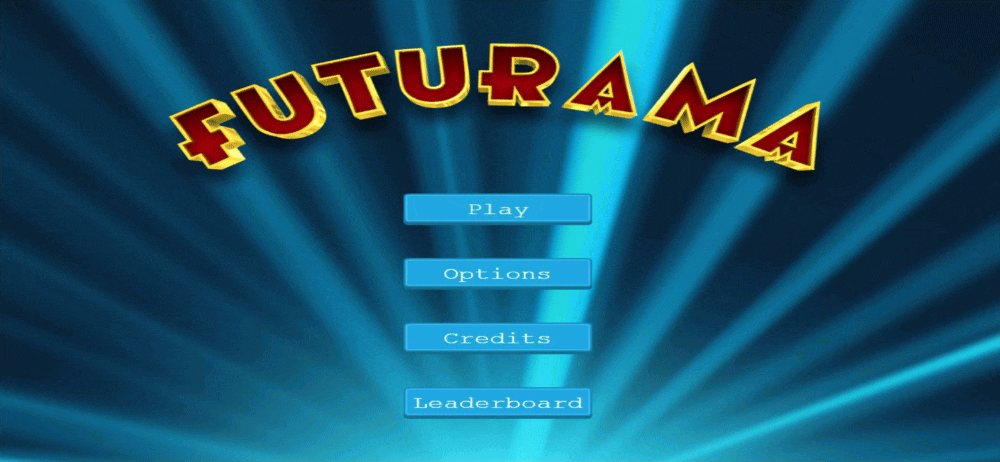

# Futurama Shooter - Phaser 3 Game - JS

> JavaScript - Phaser 3 Game Capstone project.

## Game:



Check the Game Design Document I made before starting out: [Game Design Doc](src/assets/docs/GameDesign.md)
## Built With

- JavaScript (ES6)
- Phaser-3
- Photoshop CC
- Node.js
- Webpack
- ESLint
- Stylelint

## Live Demo

- You can click on this [link](https://bismarck-gm.github.io/JS-Capstone-Phaser/)

## Getting Started

### Prerequisites

- Node.js
- Any Browser

To get started open the directory where you will save this repo by typing on your terminal:

```
$ cd <directory>
```

- Clone the repo typing:

```
$ git clone git@github.com:Bismarck-GM/JS-Capstone-Phaser.git
```

- Install dependencies:

```
$ npm install
```

### Usage

Start the server:

```
$ npm run start
```

Open `http://localhost:8080/` in your browser.

## Author

👤 **Gerónimo Morisot**

- Github: [@Bismarck-GM](https://github.com/Bismarck-GM)
- Twitter: [@Rewritablee](https://twitter.com/Rewritablee)
- Linkedin: [geronimomorisot](https://linkedin.com/in/geronimomorisot)

## 🤝 Contributing

Contributions, issues and feature requests are welcome!

## Show your support

Give a ⭐️ if you like this project!
Feel free to check the [issues page](issues/).

## Acknowledgments

- Project requested by [Microverse Program](https://www.microverse.org/).

## 📝 License

This project is [MIT](lic.url) licensed.
