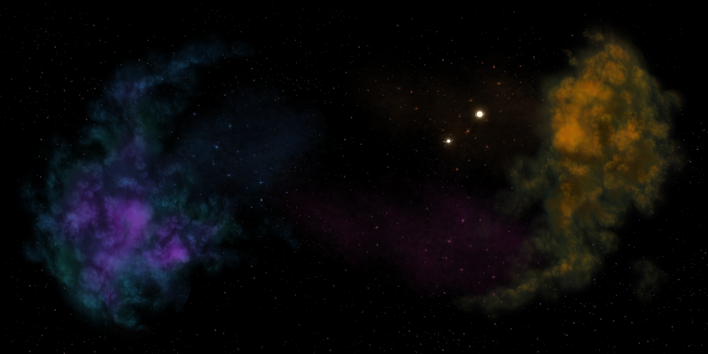
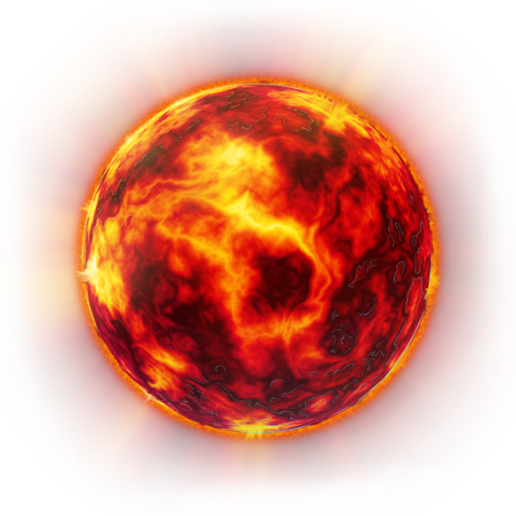
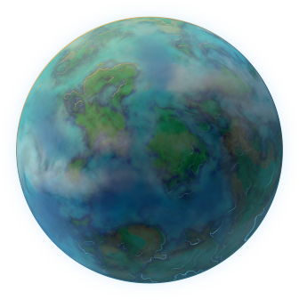
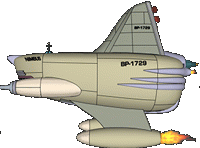
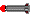

# Introduction

Here is where all the process of developing the game stands. Ideas and changes doing on track of it.

# Progress Log

## 1 - First-thoughts / Layout

The project request is for the game to be a shooter. I thought to develop a side scroller shoot-em-up where the player is going to be able to traverse through the whole map using W-A-S-D keys and point'n'shoot with the mouse.

For this idea what first came to mind is base it in Space and follow to that thought it came to mind for it to be based in the Futurama TV show.
Simple fly around and have a posibility to spawn Enemies in waves and for n amount of waves have a boss encounter. Every wave is going to be harder than the last one, same with the boss. Enemies will have health points.

No levels, just infinite scroll to see how much Score the player could get.

Having stated this I already have something in mind so I went to my trusty notebook to draw it.

First draft: It's basically a rectangle with the player ship some HUD elements and enemies coming into view in a pattern sort of way.
Imagine it being a Galaga game but sideways.

So I have an idea of WHAT to build. After this I started splitting everything into smaller steps.

## 2 - Disecting Game Idea

### 0. Menues - Phaser

Everything will be done using Phaser 3 and Webpack.

Stating that. First I follow the tutorials Microverse gave us. First one is by Phaser and basics. Second one is to get use with webpack and Phaser, split files accordingly and set up Extensions of Phaser Classes to add our code.
And most importantly split the game in Scenes.

Having some practice and confidence with Phaser made me think about extending the functionalities of the Game (sky's not the roof).

Here is where one of my main goals of this project came to mind.

I want this game to be responsive!

I don't like open a browser window in a Full-HD monitor to have a game at 800x600. It looks awfull and makes it feel dated.

So I spent lots of time and hacky things for phaser until I got it working with a simple Splash Screen with a Full-HD Futurama Image I got from Google.

Great feeling when something I never worked with was doing what I was expecting!

### 1. Scenes

Basically here there wasn't much to set up after the tutorial.

Since it'll have only one long level the Scenes where:

- Boot.
- Preload.
- TitleScene.
- Game.
- Options.
- Credits.
- Scoreboard.
- Game Over with new High Score.
- Game Over with no High Score.

Simple!

## 3. Game Scene

As everything was set up after the 2nd tutorial and the responsiveness is working I could get/create all the assets I need for the main game.

For this I started searching for Futurama spritesheets... which I could not find any... so to the very next thing! Background!
I found a really nice Space Background in a PSD format at OpenGameArt (link below).

Having a nice background inspired me to set up everything following up the 3rd tutorial (which teaches you how to build a shooter top-to-bottom scroller).

- Load all its assets discarding the background.
- Extend Phaser 3 Classes to create Entities.
- Add basic logic to GameScene to move, spawn enemies, physics and scrolling background.

Having made all of this I now have somewhere to customize with my objectives.

## 4. Customizing

Here's where all the magic and the headaches happens.

Understanding what the 3rd Tutorial proposed and created I started customizing everything about it.

In which I lost a lot of time debugging things that weren't ment to work in the way I wanted. But was reconforting seeing everything come, somewhat, together after tons of hits and misses.
After seeing my project may never come to an end I have to cut my lossess and finish it!

To keep it simple it's resumed what I ideas I kept and what I discarded:

What I kept:
- Futurama themed.
- Side scroll.
- WASD keys for movement and mouse to point and shoot.
- Enemies fire upon Player position.
- Enemy tracker (Missile) which follow you around.
- Spawn enemies regarding Player Score.

Discarded:
- Enemies Health Points.
- Bosses.
- Enemies waves and enemies pattern path.

Basically I was trying to bite more of what I can chew!

# Gameplay

## Player

So for the player ship the main point was to model Bessie (futurama's ship) out of any image found in the internet.
Doing that I created a simple spritesheet with animation for the rocket engines to be lit.

The player will controll Bessie and guide it through the screen with W-A-S-D keyboard keys.
Bessie will always be pointing to the Mouse-Cursor and fire upon its position when the Left-Click is pressed.
If the fire button is maintained Bessie will keep firing.

## Level

There's only one level which Scrolls infinitely.

And there's two planets that scroll from fixed positions.

## Enemies

Enemies features:

- Nimbus: Shoots laser upon Players Position.

- Missile: Travels right-to-left, when it gets to a certain range it follows the Players ship.

# Developer's Notes

This project was developed in these stages:

- Stage 1: Learning how to use Phaser 3, following tutorials and how to setup a game's structure built with Javascript (1 day).
- Stage 2: Creating the project's codes organizational structure (1 day).
- Stage 3: Creating the project's scenes (1 day)
- Stage 4: Creating the project's classes, tests, custom Sprites and soundsFX (3 days).
- Stage 5: Testing the gameplay, fixing bugs and deployment (5 days).
- Stage 6: Building this GDD (0.5 day).

# Making Of

This project was built using [Phaser 3](https://phaser.io/phaser3), [Webpack](https://webpack.js.org/), Javascript and Photoshop.

# Acknowledgements

- Thanks to [OpenGameArt](https://opengameart.org/) for the free assets

  - Background: [Tatermand](opengameart.org/users/tatermand)
  - Missile: [SamOliver](https://opengameart.org/users/samoliver)
  - Explosion: [Cuzco](https://opengameart.org/users/cuzco)
